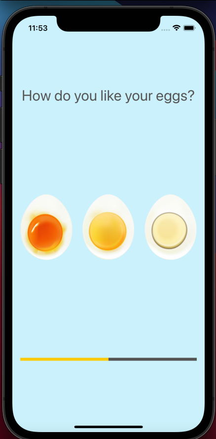
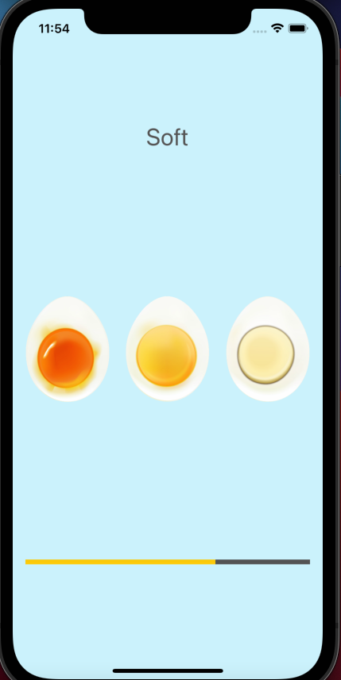
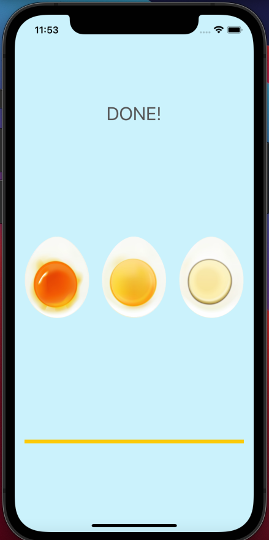

# Egg Timer
After user selects the egg type he/she want the timer will start to count down and after the timer is finished it plays an alarm sound to tell user the egg is ready

Step1:

Step2:

Step3:

